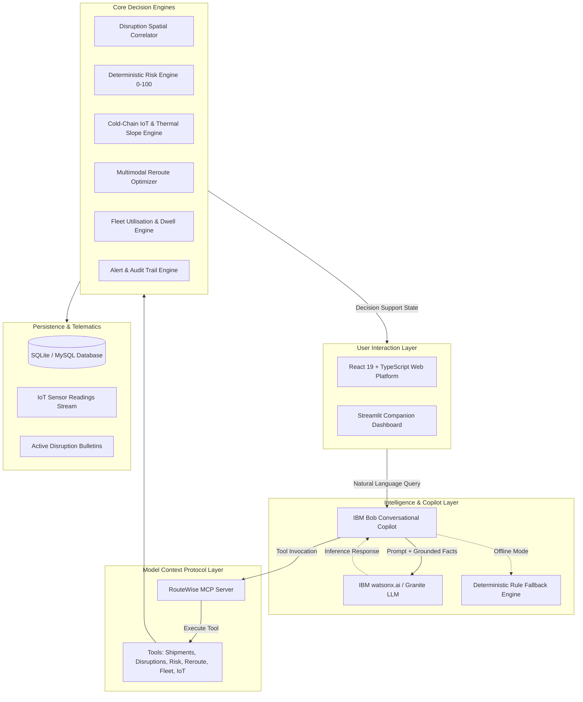

# RouteWise AI 🚢
> **Intelligent Supply-Chain Disruption Copilot & Fleet Resilience Control Tower**  
> *Built for the IBM Bob AI Innovation Hackathon 2026*

[](https://github.com/AarchiPatel2602/bob-ai-hackathon-charusat/actions/workflows/validate.yml)
[](https://opensource.org/licenses/MIT)
[](https://www.python.org/downloads/)
[](https://react.dev/)
[](https://fastapi.tiangolo.com/)

---

## 👥 Team Information

- **Team Name:** CoderGo
- **Track:** AI
- **Team Lead:** Ayush Vyas ([D25IT130@CHARUSAT.EDU.IN](mailto:D25IT130@CHARUSAT.EDU.IN))
- **Team Members:**
  - Aarchi Patel ([D25IT133@charusat.edu.in](mailto:D25IT133@charusat.edu.in))
  - Nitya Chokshi ([D25ME097@charusat.edu.in](mailto:D25ME097@charusat.edu.in))
  - Hitarth Chauhan ([24ME006@charusat.edu.in](mailto:24ME006@charusat.edu.in))
- **GitHub Repository:** [https://github.com/AarchiPatel2602/bob-ai-hackathon-charusat](https://github.com/AarchiPatel2602/bob-ai-hackathon-charusat)

---

## 📌 Problem Statement

Global logistics networks transport billions of dollars in temperature-sensitive cargo—including vaccines, biologics, pharmaceuticals, and fresh produce. When operational disruptions strike (severe typhoons, port labor strikes, canal bottlenecks, and geopolitical route closures), logistics management is crippled by fragmented information:

1. **Fragmented Disruption Telemetry:** Weather warnings, port status reports, and maritime advisories arrive across disconnected feeds. Dispatchers cannot rapidly determine which active consignments intersect impacted zones.
2. **Cold-Chain Vulnerability:** High-value consignments require strict temperature compliance (e.g., 2.0°C to 8.0°C). Unanticipated transit delays lead to container refrigeration failures, auxiliary power drains, and irreversible spoilage.
3. **Manual Decision Latency:** Re-routing cargo requires manually analyzing alternative transshipment corridors, carrier performance history, freight surcharges, and container compliance—a process taking hours while cargo deteriorates.
4. **Underutilized Fleet Surge Capacity:** While certain hubs face container gridlock, nearby fleet assets sit idle in regional depots because dispatchers lack cross-network visibility to redeploy them.

---

## 💡 The Solution: RouteWise AI

**RouteWise AI** is an intelligent, autonomous decision-support control tower and conversational copilot powered by IBM technologies. It unifies the entire supply-chain resilience loop:

$$\text{DISRUPTION} \longrightarrow \text{IMPACT} \longrightarrow \text{RISK (0--100)} \longrightarrow \text{ALTERNATIVES} \longrightarrow \text{FLEET} \longrightarrow \text{COLD-CHAIN} \longrightarrow \text{IBM BOB} \longrightarrow \text{ACTION}$$

RouteWise AI continuously correlates real-time disruptions with active consignments, calculates deterministic risk scores, monitors IoT thermal telemetry with predictive slope breach detection, discovers multimodal bypass routes, recommends idle fleet redeployments, and provides an interactive conversational assistant (**IBM Bob**) grounded in ground-truth operational facts.

---

## 🚀 Key Features

### 1. Conversational AI Assistant (IBM Bob Copilot)
- **Natural Language Interaction:** Query network status, at-risk consignments, thermal anomalies, and rerouting tradeoffs in plain English.
- **Strict Factual Grounding:** Every AI response cites verified shipment IDs, exact cargo values, live temperature readings, and spatial disruption facts—zero hallucination.
- **Hybrid Intelligence:** Orchestrates calls to IBM watsonx / Granite models with a local deterministic decision-support engine fallback for guaranteed 100% operational uptime.

### 2. Model Context Protocol (MCP) Integration
- Implements the **Model Context Protocol (MCP)** specification via JSON-RPC stdio and REST endpoints (`/api/mcp/tools` and `/api/mcp/call`).
- Exposes 6 standardized logistics tools:
  - `get_active_shipments`: Filter active consignments by risk category and cold-chain flag.
  - `get_disruption_feed`: Retrieve active port strikes, maritime storms, and bottleneck events.
  - `assess_shipment_risk`: Compute deterministic 0–100 risk score and drivers.
  - `simulate_route_alternatives`: Evaluate multimodal bypass corridors with delta time and cost.
  - `get_idle_fleet_assets`: Query idle trucks and container vessels available for surge redeployment.
  - `get_cold_chain_telemetry`: Retrieve live IoT sensor streams and breach forecasts.

### 3. Cold-Chain IoT Surveillance & Predictive Breach Engine
- Monitors sensor telemetry against configurable compliance profiles (e.g., *Pharma Bio-Specimens: 2.0°C – 8.0°C*).
- Classifies excursions into **NORMAL**, **WARNING**, **MAJOR**, and **CRITICAL**.
- **Predictive Breach Detection:** Calculates the thermal rate of change ($\Delta T / \Delta t$) to project time-to-breach (*"THERMAL BREACH LIKELY in ~15 minutes"*), allowing proactive intervention before cargo spoilage.

### 4. Deterministic Risk Engine (0–100 Scale)
- Auditable, transparent risk scoring:
  - **0–30:** LOW RISK (Nominal transit)
  - **31–60:** MEDIUM RISK (Minor delay advisory)
  - **61–80:** HIGH RISK (Direct disruption exposure)
  - **81–100:** CRITICAL RISK (Active thermal excursion + blocked corridor)
- Factors disruption proximity, delay duration, consignment valuation thresholds, cargo sensitivity class, and real-time telematics.

### 5. Multimodal Alternative Rerouting Engine
- Evaluates viable bypass corridors (e.g., Ocean bypass via Colombo Deep Sea Terminal vs. Intermodal Air-Sea via Frankfurt).
- Calculates delta transit time (hours), freight cost delta (USD), projected risk reduction (e.g., 99/100 to 24/100), and cold-chain certification compatibility.
- Auto-ranks carriers (Maersk, MSC, CMA CGM, Hapag-Lloyd) with badges: **BEST OVERALL**, **FASTEST**, and **BEST VALUE**.

### 6. Fleet Utilisation & Surge Redeployment Engine
- Calculates real-time network fleet utilisation:
  $$\text{Utilisation \%} = \frac{\text{Active Capacity}}{\text{Total Capacity}} \times 100\%$$
- Monitors asset dwell time to identify idle equipment (e.g., TRUCK-205 in Ahmedabad idle for 8 hours).
- Matches idle reefer/dry capacity with surge demand locations and recommends redeployments with projected utilisation recovery (+3.4%).

---

## 🏗️ Technical Architecture



### Component Breakdown

| Component | Technology | Responsibility |
|---|---|---|
| **Web Frontend** | React 19, TypeScript, Vite, Tailwind CSS v4, Leaflet | Enterprise control tower, interactive maps, telemetry graphs, 1-click approvals, Bob Copilot drawer. |
| **Companion App** | Streamlit, Pandas, Python 3.13 | Single-command demonstration companion dashboard. |
| **Backend API** | FastAPI, SQLAlchemy 2.0, Pydantic v2 | High-performance asynchronous REST API, JWT authentication, CORS security. |
| **MCP Server** | Python, JSON-RPC 2.0 | Standardized Model Context Protocol tool endpoints for AI agent interoperability. |
| **AI Copilot** | IBM Bob + watsonx.ai / Granite | Conversational natural language interface with factual grounding and offline rule engine. |
| **Storage** | SQLite (default zero-config) / MySQL | Relational data persistence with foreign-key integrity and audit logging. |

---

## 📂 Repository Structure

```
bob-ai-hackathon-charusat/
├── .github/
│   └── workflows/
│       └── validate.yml          # Official hackathon submission validator (DO NOT MODIFY)
├── demo/
│   ├── demo-video-link.txt       # Video walkthrough link
│   ├── live-demo-url.txt         # Deployment status (NOT DEPLOYED — run locally)
│   ├── screenshots/              # 3 high-resolution application screenshots
│   │   ├── 01-home-dashboard.png
│   │   ├── 02-query-input.png
│   │   └── 03-result-output.png
│   └── README.md
├── docs/
│   ├── problem-statement.md      # Detailed problem analysis & cold-chain impact
│   ├── solution-overview.md      # End-to-end value chain & workflow explanation
│   ├── architecture.md           # System architecture, Mermaid diagrams & data flow
│   └── setup-guide.md            # Step-by-step local installation & verification guide
├── presentation/
│   ├── slides.pdf                # 8-slide executive presentation PDF
│   └── README.md
├── src/
│   ├── backend/                  # FastAPI server, 10 calculation engines, models & tests
│   ├── frontend/                 # React 19 + TypeScript + Vite + Tailwind web dashboard
│   ├── mcp/                      # RouteWise Model Context Protocol (MCP) server
│   ├── app.py                    # Streamlit companion copilot dashboard
│   ├── requirements.txt          # Unified Python dependencies
│   ├── .env.example              # Environment variables template
│   └── README.md                 # Source code organization overview
├── .gitignore                    # Comprehensive ignore rules (protects .env and database)
├── CONTRIBUTING.md               # Hackathon contribution and submission rules
├── run_backend.py                # Single-command root backend runner
├── submission.yaml               # Validated hackathon submission manifest
└── README.md                     # This documentation
```

---

## ⚡ Quick Start & How to Run

### Prerequisites
- **Python:** 3.10 or higher (Python 3.13 tested)
- **Node.js:** v18 or higher with npm
- **Git**

### 1. Clone the Repository
```bash
git clone https://github.com/AarchiPatel2602/bob-ai-hackathon-charusat.git
cd bob-ai-hackathon-charusat
```

### 2. Backend Setup
```bash
# Create and activate virtual environment
python -m venv venv

# Windows PowerShell:
.\venv\Scripts\activate
# Linux / macOS:
source venv/bin/activate

# Install Python dependencies
pip install -r src/requirements.txt

# Copy environment variables
cp src/.env.example .env

# Initialize and seed database with 50+ shipments, fleet, and disruptions
python src/backend/seed.py

# Start FastAPI server on port 8000
python run_backend.py
```
👉 Interactive Swagger API documentation: **http://127.0.0.1:8000/docs**

### 3. Frontend Setup (React 19 + Vite)
```bash
# In a new terminal, navigate to frontend:
cd src/frontend

# Install dependencies
npm install

# Start development server on port 5173
npm run dev -- --host 127.0.0.1 --port 5173
```
👉 Access RouteWise AI Control Tower: **http://127.0.0.1:5173**

### 4. Streamlit Companion Dashboard (Optional Alternative)
```bash
# In an activated virtual environment:
streamlit run src/app.py
```
👉 Access Streamlit Companion: **http://127.0.0.1:8501**

---

## 🔑 Demo Credentials

| Role | Email | Password |
|---|---|---|
| **Global Logistics Director** | `demo@supplyguard.io` | `SupplyGuard2026!` |
| **RouteWise Operations Lead** | `demo@routewise.io` | `RouteWise2026!` |

*(The web interface login screen includes a 1-click **"Auto-Fill Demo Credentials"** button for quick evaluation.)*

---

## 🎬 Hackathon Demonstration Scenario

Experience the complete end-to-end incident mitigation workflow in under 3 minutes:

1. **Sign In:** Use the 1-click credential auto-fill to access the Command Center.
2. **Dashboard Overview:** Review real-time KPIs: 53 active shipments, 1 consignment at risk, 3 active disruptions, and 68.8% fleet utilisation.
3. **Trigger Disruption:** Click **"Run Hackathon Demo"** in the top navigation bar. A high-severity strike is registered at Mumbai Port. High-value consignment **SH-1024** (Vaccines, \$620,000, Mumbai ➔ Rotterdam) origin is blocked, elevating its risk score from 15 to 68.
4. **Cold-Chain IoT Excursion:** Open **SH-1024** and view the **Cold-Chain IoT** tab. Container temperatures rise (7.8°C ➔ 8.4°C). The predictive breach engine triggers a critical slope alert: risk surges to **99/100 (CRITICAL)**.
5. **Ask IBM Bob Copilot:** Open the **IBM Bob Copilot** tab and query:
   > *"Why is shipment SH-1024 at risk and what should we do?"*
   Bob returns structured root-cause evidence from MCP data sources and recommends approving Alternative A.
6. **Evaluate & Approve Reroute:** In the **Alternative Routes** tab, compare corridors. Select **Alternative A (Transshipment via Colombo)** (+18h, +\$8,400). Click **"Approve Reroute"**—risk plummets from 99 to **24/100 (LOW)**.
7. **Fleet Repositioning:** Open **Fleet** to view **TRUCK-205** (Ahmedabad, Reefer, Idle for 8h). Click **"Approve Redeployment"** to dispatch it to Mumbai, recovering +3.4% network capacity.
8. **Audit Verification:** Inspect **Alerts** to verify that all mitigation approvals and route changes are recorded in the immutable audit log.

---

## 🧪 Verification & Automated Tests

### Backend Unit Tests (19 Test Cases)
Tests cover shipment creation, disruption spatial detection, 0–100 risk scoring, multimodal rerouting, carrier ranking, idle fleet detection, cold-chain excursion analysis, alert dispatch, and conversational AI intent routing:
```bash
python -m pytest src/backend/tests/test_supplyguard.py src/backend/tests/test_ai_chat.py -v
```
**Result:** `19 passed in 0.60s (100% success rate)`

### Live End-to-End Integration Tests (15 Test Workflows)
Tests verify live health check, JWT auth, dashboard summary, route alternatives, carrier tags, fleet matching, sensor simulation, alert resolution, AI decision support, and the complete 1-click hackathon flow:
```bash
python src/backend/tests/test_live_api.py
```
**Result:** `ALL 15 LIVE END-TO-END INTEGRATION TESTS PASSED`

### Model Context Protocol (MCP) Verification
```bash
python -m src.mcp.routewise_mcp --list-tools
```
**Result:** `6 registered MCP tools verified`

### Frontend Build Verification
```bash
cd src/frontend && npm run build
```
**Result:** `0 errors, built client environment in 618ms`

---

## 🔍 Technical Honesty & Implementation Scope

To maintain complete transparency for hackathon evaluation, capabilities are classified as follows:

| Capability | Status | Implementation Details |
|---|---|---|
| **0–100 Deterministic Risk Engine** | **IMPLEMENTED** | Full calculation engine factoring delays, disruption geometry, cargo value, and IoT thermal drift. |
| **Cold-Chain IoT & Thermal Slope** | **IMPLEMENTED** | Sensor reading generator, duration counter, severity classifier, and $\Delta T / \Delta t$ breach predictor. |
| **Multimodal Rerouting Matrix** | **IMPLEMENTED** | Dynamic alternative corridor generator with delta cost, delta time, carrier ranking, and 1-click approval. |
| **Fleet Utilisation & Repositioning** | **IMPLEMENTED** | Dwell-time calculator, idle asset detector, capacity matcher, and redeployment approval workflow. |
| **Model Context Protocol (MCP)** | **IMPLEMENTED** | Complete Python MCP server implementation with 6 standardized tool schemas and JSON-RPC dispatch. |
| **IBM Bob Conversational Assistant** | **IMPLEMENTED** | Natural language copilot endpoint (`/api/ai/chat`) and interactive UI drawer with grounded fact retrieval. |
| **IBM watsonx.ai / Granite LLM** | **OPTIONAL / READY** | Live API connector implemented in `ai_service.py` (`IBM_AI_API_KEY`, `IBM_BOB_API_URL`). Activates automatically when configured; seamlessly falls back to local deterministic reasoning when blank. |
| **Disruption Data Feeds** | **SIMULATED** | Seeded with realistic port strikes (Mumbai), typhoons (South China Sea), and bottlenecks (Suez Canal) for repeatable demonstration. |
| **Cloud Deployment** | **NOT DEPLOYED** | Designed and verified for local execution as instructed in `demo/live-demo-url.txt`. |

---

## 🔮 Future Roadmap

1. **Live Telematics Ingestion:** Connect real-world GPS transponders and reefer OBD-II telemetry streams via MQTT and Apache Kafka.
2. **Autonomous Carrier Spot Bidding:** Implement multi-agent negotiation protocols to bid and secure alternative freight slots during regional stoppages.
3. **Predictive Micro-Climate Modeling:** Integrate NOAA and ECMWF numerical weather prediction grids into route risk calculations.
4. **Enterprise ERP Connectors:** Bi-directional webhooks and integrations with SAP Transportation Management and Oracle SCM Cloud.

---

## 📄 License

This project is submitted for the IBM Bob AI Hackathon 2026 under the MIT License.
