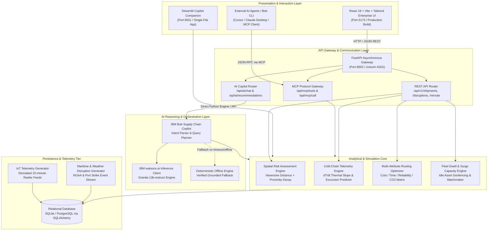

# Technical Architecture: RouteWise AI

## System Design & Architecture Specification

RouteWise AI implements a decoupled, modern multi-tier architecture engineered for resilience, real-time spatial analysis, and seamless AI copilot orchestration. The system integrates standard REST and JSON-RPC APIs with the **Model Context Protocol (MCP)**, connecting enterprise logistics databases to **IBM Bob** and **IBM watsonx.ai**.

---

## 1. System Architecture Diagram



---

## 2. Component Breakdown & Technology Stack

| Layer | Component | Technology | Responsibility |
|---|---|---|---|
| **Client** | Enterprise Web UI | React 18, TypeScript, Vite, Tailwind CSS, Lucide | Primary operations dashboard: interactive maps, sensor telemetry charts, route comparisons, and IBM Bob Copilot drawer. |
| **Client** | Streamlit Companion | Python 3.9+, Streamlit, Pandas | Standalone zero-npm alternative for quick hackathon evaluation, single-command field deployment, and prototype testing. |
| **Gateway** | Asynchronous API | FastAPI, Starlette, Uvicorn, Pydantic v2 | High-throughput REST API and MCP router with automatic OpenAPI / Swagger specifications and typed payload validation. |
| **Agent / MCP** | Model Context Protocol Server | Python MCP Implementation | Exposes 6 standardized agentic tools enabling IBM Bob and external LLM runners to safely query and interact with logistics state. |
| **AI Copilot** | Conversational Core | IBM Bob Orchestration + watsonx.ai SDK | Natural language intent parser, context assembly, multi-turn reasoning, and deterministic fallback generation. |
| **Engines** | Risk & Routing Analytics | NumPy, SciPy, Haversine, Python Math | Calculates spatial proximity decay, delays, cold-chain thermal slope ($\Delta T / \Delta t$), and weighted route utility scores. |
| **Storage** | Persistence Tier | SQLAlchemy 2.0 ORM, SQLite3 (dev), PostgreSQL (prod) | Relational persistence for shipments, route waypoints, sensor readings, fleet assets, and disruption events. |

---

## 3. End-to-End Data Flow Sequence

The diagram below illustrates how an operational question (e.g., *"Why is shipment SH-001 delayed and what should we do?"*) travels through the architecture:

```mermaid
sequenceDiagram
    autonumber
    actor Dispatcher as Logistics Dispatcher
    participant UI as React / Streamlit UI
    participant API as FastAPI / AI Router
    participant Copilot as IBM Bob Copilot Engine
    participant DB as Relational DB & Engines
    participant Watson as IBM watsonx.ai (Granite)

    Dispatcher->>UI: Types: "Why is shipment SH-001 delayed and what should we do?"
    UI->>API: POST /api/ai/chat { "query": "Why is shipment SH-001 delayed...", "history": [] }
    API->>Copilot: Dispatch query to conversational service
    Copilot->>DB: Query shipment SH-001 state, active disruptions, & thermal telemetry
    DB-->>Copilot: Return: "SH-001 near Rotterdam, Port Strike Active, Temp=4.8C, Slope=+0.41C/hr"
    Copilot->>DB: Invoke Reroute Engine & Idle Fleet Matchmaker for SH-001
    DB-->>Copilot: Return: "Bypass Corridor: Antwerp Rail ($1,850 delta, -14h saved); Truck-205 idle"
    
    alt WatsonX API Available
        Copilot->>Watson: Prompt with assembled context, query, and operational guidelines
        Watson-->>Copilot: Synthesized natural language response with structured recommendations
    else WatsonX Offline / No Key Configured
        Copilot->>Copilot: Trigger deterministic grounded reasoning engine
        Copilot-->>Copilot: Construct verified response with evidence, severity, and action items
    end

    Copilot-->>API: Return structured ChatResponse (answer, severity, evidence, recommendations)
    API-->>UI: 200 OK with JSON payload
    UI-->>Dispatcher: Display formatted copilot message, badge markers, and one-click reroute button
```

---

## 4. Model Context Protocol (MCP) Tool Specifications

RouteWise AI implements the open **Model Context Protocol**, allowing any compliant AI runtime to discover and execute supply chain tools:

```
Endpoint: POST /api/mcp/tools
Returns: List of available tool declarations with JSON schema parameters.

Endpoint: POST /api/mcp/call
Payload: { "tool_name": "<name>", "arguments": { ... } }
```

### Exposed MCP Tools:

1. **`get_active_shipments(status?: string, cargo_type?: string)`**
   - Retrieves active shipments filtered by operational status (IN_TRANSIT, DELAYED, EXCURSION) or cargo sensitivity (Pharma, Perishable, Hazardous, General).
2. **`get_disruption_feed(severity?: string)`**
   - Returns active spatial disruptions (Port Strike, Weather, Chokepoint) with epicenter coordinates, radius (km), and projected delay impact.
3. **`assess_shipment_risk(shipment_id: string)`**
   - Computes dynamic risk score (0–100) combining distance to active disruption zones, vessel speed, cargo fragility, and dwell time.
4. **`simulate_route_alternatives(shipment_id: string, optimize_for?: string)`**
   - Generates ranked alternative corridors comparing direct financial delta, delay avoidance (hours), carrier reliability rating, and carbon emissions.
5. **`get_idle_fleet_assets(location?: string, min_idle_hours?: number)`**
   - Locates available tractors, reefer trailers, and chassis dwelling beyond standard depot thresholds to absorb diverted freight.
6. **`get_cold_chain_telemetry(shipment_id: string)`**
   - Streams IoT reefer logs, calculating current temperature, excursion boundary violations, and hourly thermal drift slope ($\Delta T / \Delta t$).

---

## 5. Cold-Chain Physics & Risk Mathematical Modeling

### A. Thermal Slope Derivation
To prevent irreversible denaturation of temperature-critical biopharmaceuticals, the system evaluates the linear thermal rate of change over a sliding window of sensor observations:

$$\beta = \frac{T_n - T_0}{t_n - t_0} \quad \left[\frac{^\circ\text{C}}{\text{hr}}\right]$$

- **Normal Drift:** $\beta \le 0.15^\circ\text{C/hr}$ (passive reefer insulation cycling).
- **Warning Drift:** $0.15 < \beta \le 0.35^\circ\text{C/hr}$ (refrigeration compressor cycling degradation).
- **Critical Excursion Drift:** $\beta > 0.35^\circ\text{C/hr}$ (active auxiliary power failure; immediate intervention required).

### B. Composite Multi-Factor Risk Score
Shipment vulnerability $R_s \in [0, 100]$ is computed as a weighted combination of spatial hazard exposure, cargo sensitivity, and schedule buffer:

$$R_s = \min\left(100, \; w_d \cdot D_{\text{hazard}} + w_c \cdot C_{\text{fragility}} + w_t \cdot T_{\text{thermal}} + w_s \cdot S_{\text{delay}}\right)$$

Where $D_{\text{hazard}}$ decays inversely with distance $d$ to the disruption epicenter:

$$D_{\text{hazard}} = \max\left(0, \; 1 - \frac{d}{R_{\text{impact}}}\right) \times 100$$

---

## 6. Security, Privacy & Deployment Strategy

- **Environment Configuration:** All sensitive tokens (`WATSONX_APIKEY`, `WATSONX_PROJECT_ID`, `DATABASE_URL`) are isolated in `.env` files and strictly excluded from version control via `.gitignore`.
- **CORS & Network Boundaries:** The FastAPI backend is configured with fine-grained CORS origins, permitting requests from verified frontend client ports (`http://localhost:5173`, `http://localhost:3000`, `http://localhost:8501`).
- **Containerization Readiness:** The repository is architecturally structured for zero-effort containerization into multi-stage Dockerfiles (one for FastAPI + Uvicorn, one for Nginx serving the React production bundle, and one for Streamlit).
- **Enterprise Scalability:** In production, the SQLite database can be swapped for managed PostgreSQL on IBM Cloud Databases with zero code changes via the SQLAlchemy dialect connection string.
