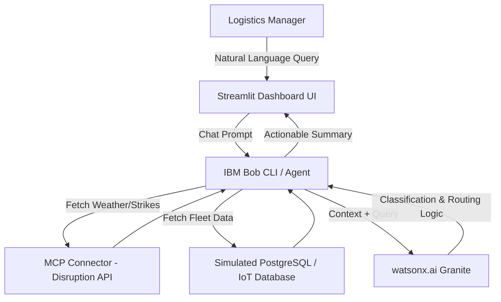

# Technical Architecture

RouteWise AI uses a modern, AI-first architecture designed to integrate IBM Bob's Copilot capabilities and watsonx.ai for intelligent decision making.

## System Components & Data Flow

## Component Table

| Component | Technology | Responsibility |
|-----------|------------|----------------|
| **Frontend UI** | Python (Streamlit) | Provides the interactive dashboard, map visualization, and Bob Copilot chat interface. |
| **AI Agent** | IBM Bob | Orchestrates user queries, manages conversation context, and acts as the bridge to external data. |
| **LLM Engine** | watsonx.ai | Analyzes supply chain data context, classifies risk severity, and generates natural language recommendations. |
| **Data Connectors** | MCP (Model Context Protocol) | Connects the AI to live external data feeds (simulated weather and port strike APIs). |

## Data Movement End-to-End
1. The user inputs a query into the Streamlit UI.
2. The UI passes the query to the IBM Bob agent.
3. The agent recognizes the need for external context and triggers an MCP connector to fetch live disruption alerts (e.g., hurricane warnings).
4. The agent simultaneously fetches internal active fleet data (location, cargo type, IoT temperature).
5. All context is bundled and sent to watsonx.ai, which synthesizes the data and generates a rerouting plan.
6. The plan is passed back through the agent to the UI for the user to read.

## Security and Scalability Notes
- **Security:** No real credentials are hardcoded. Environment variables are managed securely via `.env`.
- **Scalability:** The frontend is entirely stateless and can be containerized using Docker, allowing it to easily scale horizontally on IBM Cloud Code Engine or Kubernetes clusters.
